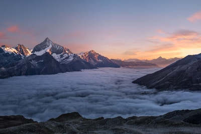

# Tourist Project

## Overview

A modern tourism website built with React and Vite, offering comprehensive travel services and tour packages.

## Features

- Website Branding & Identity
- Responsive UI Design
- Services Module with Tour Packages
- Projects/Tours Showcase
- Image Gallery
- Contact Section
- User Authentication System
- Header with Navigation Menu
- Informative Footer

## Technical Stack

- React + Vite
- Fast Refresh enabled through [@vitejs/plugin-react](https://github.com/vitejs/vite-plugin-react/blob/main/packages/plugin-react)
- Alternative SWC-based Fast Refresh via [@vitejs/plugin-react-swc](https://github.com/vitejs/vite-plugin-react/blob/main/packages/plugin-react-swc)

## Project Structure

```
src/
├── components/
│   ├── Header/
│   ├── Footer/
│   ├── Services/
│   ├── Gallery/
│   ├── Contact/
│   └── Auth/
├── pages/
├── assets/
└── utils/
```

## Getting Started

1. Clone the repository
2. Install dependencies:

```bash
npm install
```

3. Run development server:

```bash
npm run dev
```

## Development Notes

- React Compiler is not enabled by default due to performance considerations
- For production applications, TypeScript integration is recommended
- ESLint configuration can be expanded using the [typescript-eslint](https://typescript-eslint.io) plugin

## Contributing

Contributions are welcome! Please read our contributing guidelines before submitting pull requests.

## License

[Add your license information here]

## Featured Tours

### Our Popular Destinations


**Tropical Paradise Getway**

- Location: Bali
- Duration: 5 days
- Rating: 4.5/5
- Price: 38000 EGP
  Experience beautiful beaches and rich culture of Bali


**European Adventure**
Explore the city of love with our guided tour package



**Mountain Trekking**
Adventure through the breathtaking Swiss mountains

### What's Included in Our Tours

- Accommodation in 4-star hotels
- Professional tour guide
- All transportation during the tour
- Breakfast and some meals
- Entrance fees to attractions
